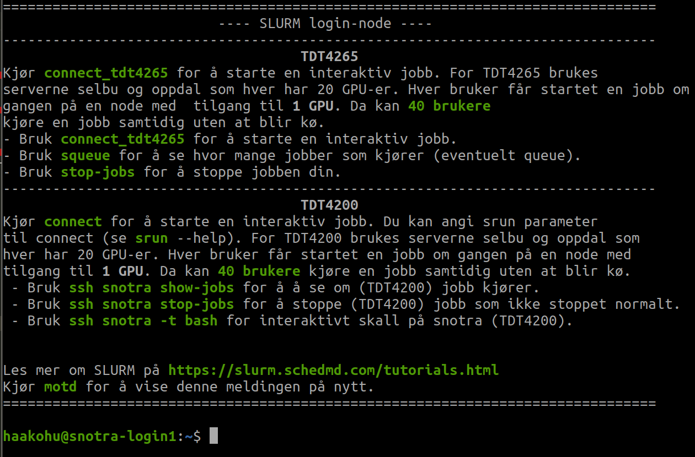
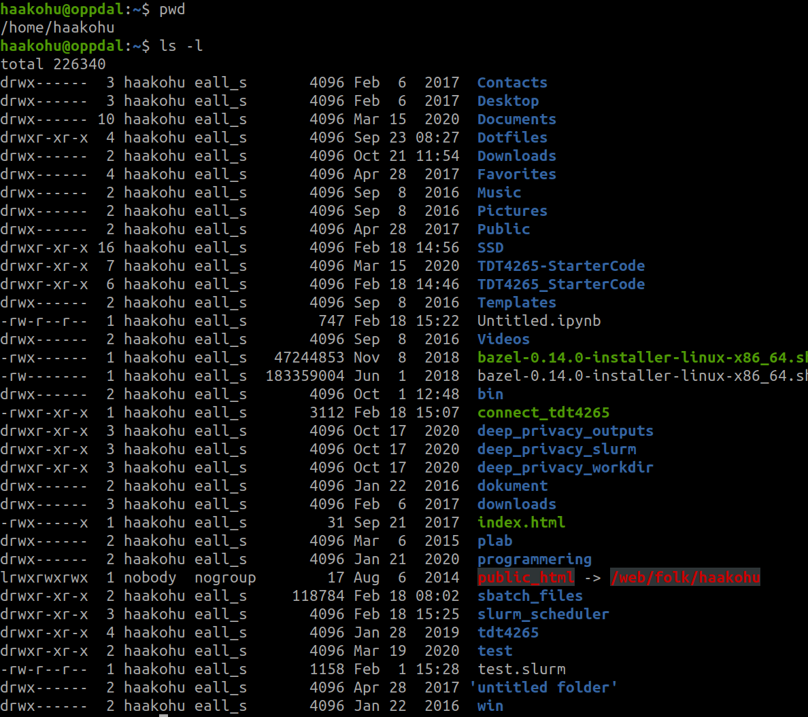
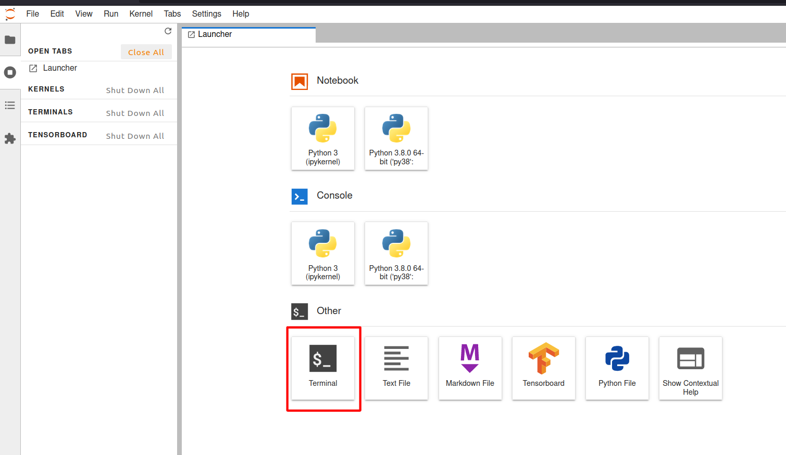

# Visual Computing Server
This server is used for exercises in TDT4195, TDT4265, and TDT17.


## Information

By logging into snotra.idi.no you will be able to request GPU resources to speed up your deep learning training jobs.
The system is only accessible from an NTNU IP address, so you will have to use **VPN** to access it from elsewhere.

## How to:
**NOTE**: For all commands, replace the username **haakohu** with your own NTNU username.
1. Log into the main server via ssh:
```
    ssh taheeraa@snotra.idi.ntnu.no
```



2. Before you start to work on the assignment, you need to **request a resource**. Type `connect_tdt4265` in the bash terminal, and this will allocate a resource for you.


3. When you are connected, you can list your current directory with `pwd`, and the available files through `ls` (notice that these are the files in your NTNU home directory).




4. You can start to work by either launching a jupyter notebook or work directly in bash.


Note that the URL printed for you is **different than mine**, as the port is unique for each student. Therefore, copy the URL that is printed from the first command (marked in red). Also, **please do not change the port**, as this might lead to your jupyter instance (or a fellow students) being unavailable.

The first time you login, you are requested a **token**. You can copy this from the area marked in red (everything after ?token=).
In my case, this was `ce2748d575cc6effb54c443ab0778a391b1b299fa66ffcc8`.


5. If you want to edit code in jupyter and run code via bash, you can start a terminal session in the launch window



6. For example, you can clone the git repository as shown below (or run python files):


7. When you are done working, please stop the resource by typing `exit` in the bash environment.

### Showing running jobs
You can print the running jobs you have with the following:


### Stopping jobs
You can print the running jobs you have with the following:
s

### Copying starter code and syncing code:

You can upload files with the following methods:

- Use git (inside or outside the running job).
- "Drag and drop" with the jupyter lab view.
-  Synchronize files with tools suchas: rsync, sshfs, or whatever floats your boat.
- NTNU-Home: the home folder (`cd $HOME`) is your NTNU home directory. This allows you to connect your local computer to NTNU Home and the code will automatically update on the server (see [this tutorial for windows](https://i.ntnu.no/wiki/-/wiki/English/Connect+to+your+home+directory+via+Windows), and [this](https://i.ntnu.no/wiki/-/wiki/English/Connect+to+your+home+directory+via+Mac+OS+X) for MacOs) .


### Time limitations
Since there are a lot more students than there are available GPUs, you are only able to reserve a GPU for a set amount of time (you can see the time limit with the command `show-jobs`).
-  `squeue`: Issuing the command `squeue` will display the status of the system, and if you request a reservation when no GPUs are available, you will be put into a **queue** (look into screen/tmux if you want to close your terminal window while waiting).
- Note that the amount of time you reserve a GPU for is logged, so make sure that you `exit` your workspace when you are done.
- Since you can only reserve the GPU for a set amount of time, your workspace will shut down when the reservation expires, so make sure that you save your model regularly if you are training for longer periods of time!

### Rules
Breaking any of the following rules can cause you to permanently loose access to the given compute resources.
- Running any jobs without slurm (using the given jupyter lab link is of course allowed) is not allowed.
- Using the cluster for any jobs which are not part of TDT4195, TDT4200, TDT4265, or TDT17 is not allowed.
- A single group can only allocate one resource at a time.


### NTNU Home restrictions
Note that your home directory `/ntnu/home` is restricted in the amount of data you can save there.
Therefore, we recommend you to save models to `/work/snotra/haakohu` to prevent filling up the ntnu home directory.


### Tips for working remotely
Take a look at the following resources:
- [Tensorboard in VSCODE](https://stackoverflow.com/questions/63938552/how-to-run-tensorboard-in-vscode)
- [Remote connect in VScode with SSD](https://marketplace.visualstudio.com/items?itemName=ms-vscode-remote.remote-ssh): **NOTE:** You can not run code on the remote connections through VScode, but you can edit files (and run them via either jupyter or bash).


### Uploading files
You can upload files with the following methods:
- Use git (inside or outside the docker container).
- "Drag and drop" with the jupyter lab view.
- Synchronize files with tools such as: rsync, sshfs, or whatever floats your boat.
- NTNU-Home: the ~/ntnu-home folder will be a symlink to your NTNU home directory


**NOTE:** We do not have a backup of your files on the server, so make sure to backup your work now and then (git is a good tool for this). Also, at the end of the semester we will delete all your files.


### Notes
As the system allocates a full GPU per user, you will be able to utilize the full GPU, which in turn makes it important that you try to only use the server for GPU intensive workloads (i.e. training your neural networks).
Debugging your code should preferably be done locally, and once you are sure you want to train to completion, you should move to oppdal (remember to double check that you move your training from CPU to GPU when you do this).

### Allocation specifications

Each compute resource allocation will have the following specification:

- 4 CPU cores @2.10Ghz
- NVIDIA T4 with 16GB of VRAM
- 16GB of RAM
